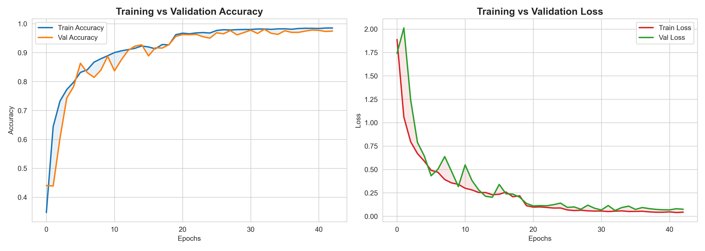
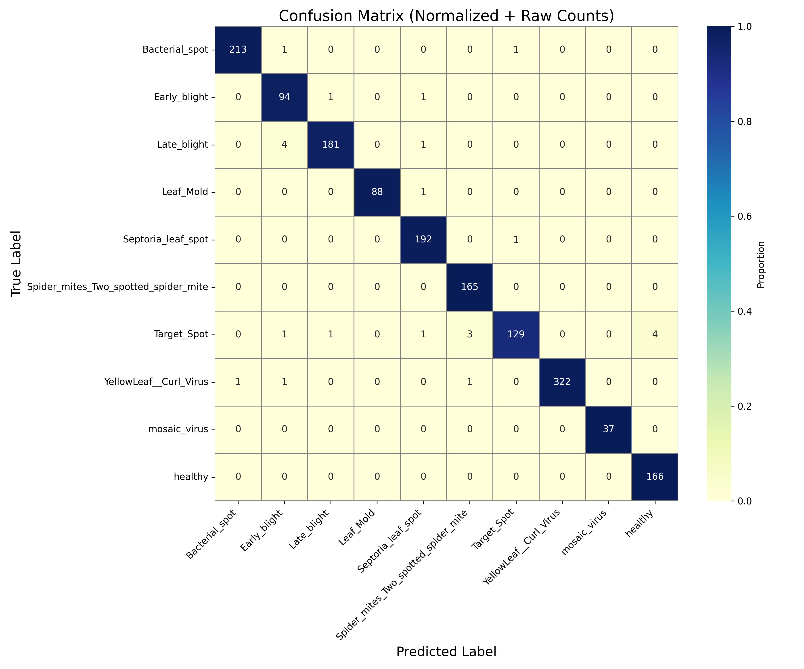
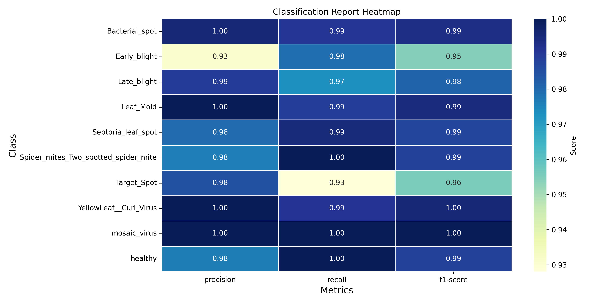
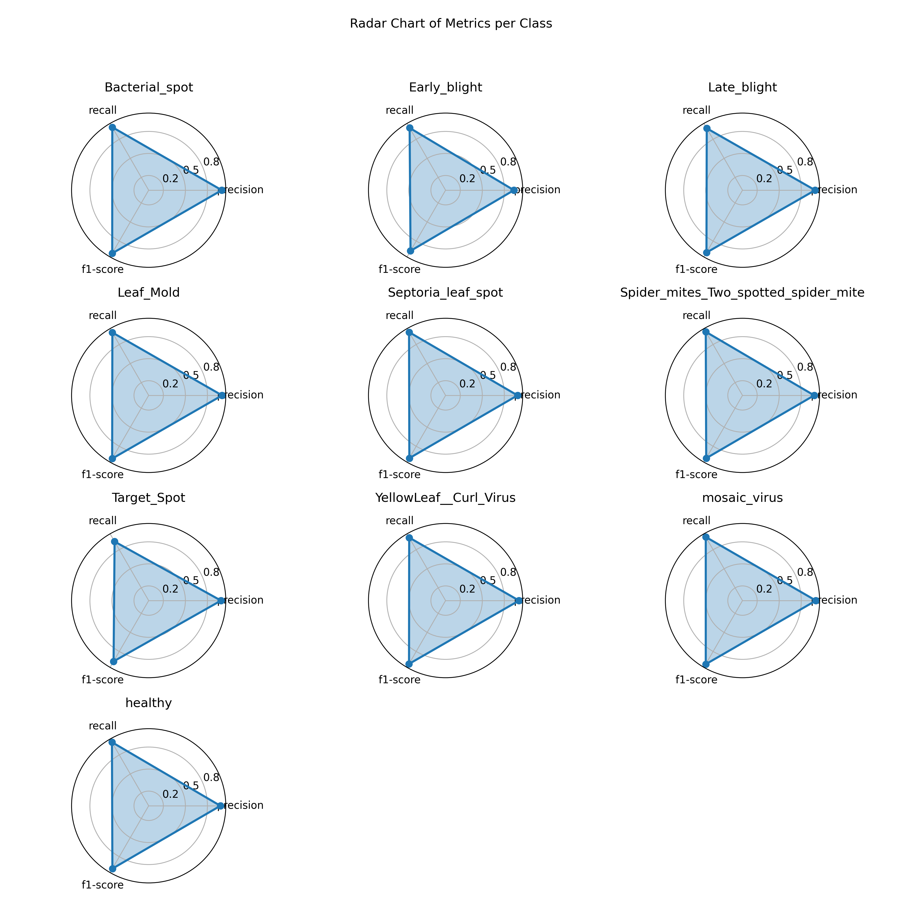
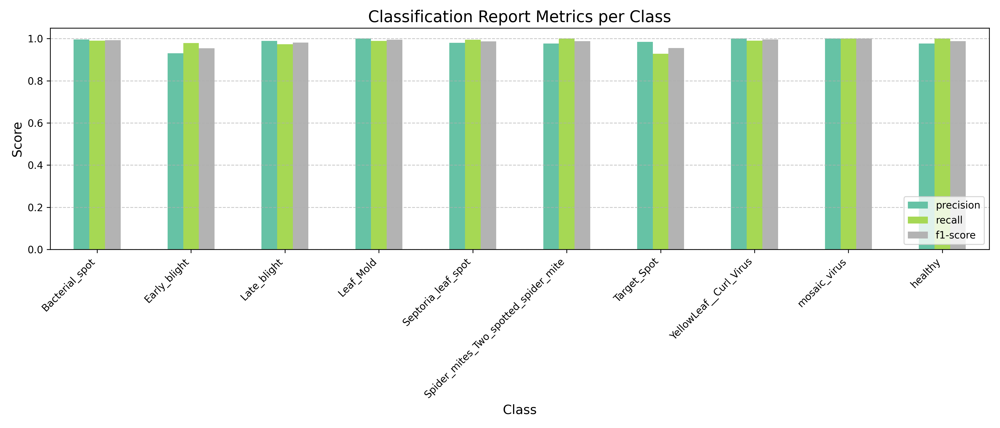
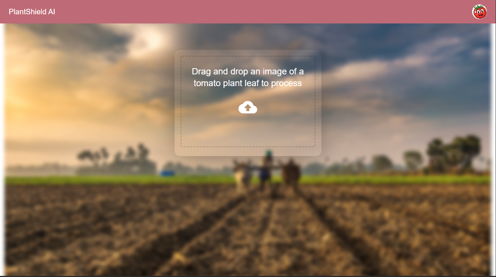
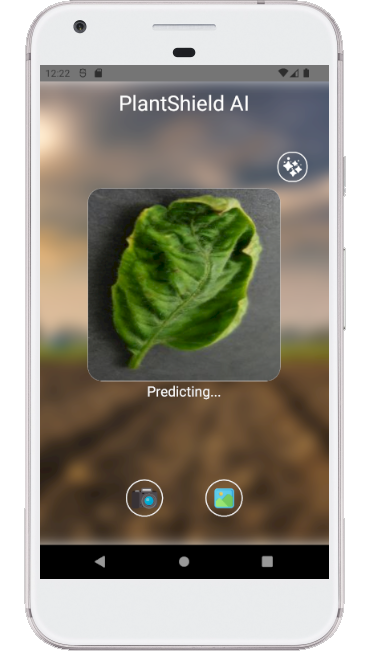
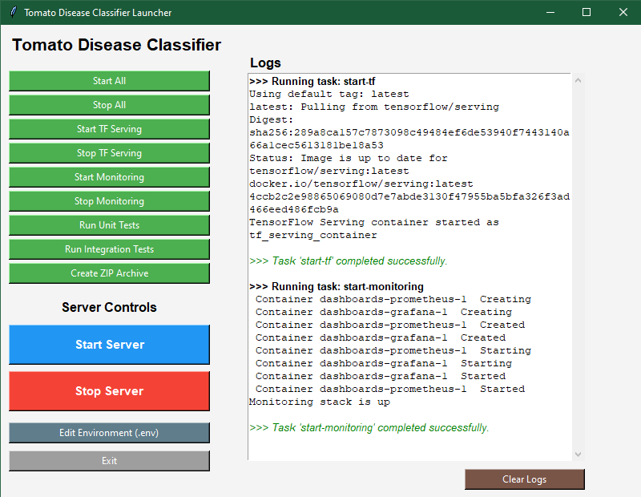

# 🌿 PlantShield AI

[](https://app.netlify.com/projects/plantshieldai/deploys)


A production-ready tomato plant disease classification system using a deep learning CNN model trained on the [PlantVillage dataset](https://www.kaggle.com/datasets/emmarex/plantdisease). The project includes web, mobile, and cloud support with monitoring, testing, and a GUI-based infrastructure controller.

<div align="center">
  
</div>
<div align="center">
  <h3 style="margin-top: 12px;">🌿 Deep Learning Powered Tomato Disease Classifier</h3>
</div>

## ✨ Features

### Deep Learning
- 🎯 Multiclass CNN model trained to classify **10 tomato plant diseases**
- ✅ Achieved **98.51% test accuracy**
- 🔍 Input shape: `(256, 256, 3)` | Batch size: `32` | 50 epochs

### Deployment Modes
- 🧪 **Local Inference** via `.keras` model
- 🐳 **TensorFlow Serving** using Docker container
- ☁️ **GCP Cloud Function** for remote inference

### Monitoring & Observability
- 🔧 Integrated **Prometheus + Grafana** via Docker Compose
- 📊 Custom dashboards (JSON-exported & version-controlled)

### Testing & CI
- 🧪 Unit tests for training, backend utils, config, routing
- 🔁 Integration tests covering all API endpoints
- 🛠️ **CI/CD** with GitHub Actions — parallel execution of all tests

### Interfaces
- 🖥️ **Frontend (React)**: Upload and predict via web UI (env-driven)
- 📱 **Mobile App (React Native CLI)**: Supports camera + image picker
- 🖱️ **Cross-platform GUI (tkinter)**: Manage API, TF Serving, monitoring, logs, `.env`, and project export

### Tooling & Config
- 🌍 Unified environment setup via `.env` (root + frontend)
- 🧰 Start/Stop automation scripts using `make`, `.sh`, `.bat`, and GUI launcher

## Model Overview

The model is a Convolutional Neural Network (CNN) trained on the [PlantVillage dataset](https://www.kaggle.com/datasets/emmarex/plantdisease) to classify 10 types of tomato plant diseases, including healthy leaves.

### Model Specs

- **Framework**: TensorFlow + Keras  
- **Input Shape**: `(256, 256, 3)`  
- **Batch Size**: `32`  
- **Epochs**: `50`  
- **Optimizer**: `adam`  
- **Loss Function**: `SparseCategoricalCrossentropy`  
- **Test Accuracy**: `98.51%`

### Supported Classes

```python
[
  'Bacterial_spot', 'Early_blight', 'Late_blight', 'Leaf_Mold',
  'Septoria_leaf_spot', 'Spider_mites_Two_spotted_spider_mite',
  'Target_Spot', 'YellowLeaf__Curl_Virus', 'mosaic_virus', 'healthy'
]
```

## Model Evaluation Plots

All plots are saved under `training/plots/`

<table>
<tr>
  <td><p align="center"><strong>Accuracy & Loss</strong></p></td>
  <td><p align="center"></p></td>
</tr>
<tr>
  <td><p align="center"></p></td>
  <td><p align="center"><strong>Confusion Matrix</strong></p></td>
</tr>
<tr>
  <td><p align="center"><strong>Classification Heatmap</strong></p></td>
  <td><p align="center"></p></td>
</tr>
<tr>
  <td><p align="center"></p></td>
  <td><p align="center"><strong>Per-Class Radar Plot</strong></p></td>
</tr>
<tr>
  <td><p align="center"><strong>Classification Report</strong></p></td>
  <td><p align="center"></p></td>
</tr>
</table>


## Directory Structure (Highlights)

```
api/
  ├── main.py               # FastAPI app entrypoint
  ├── model_local.py        # Local model inference
  ├── model_tf_serving.py   # TF Serving inference
  ├── config.py             # Reads .env
  ├── utils.py              # Preprocessing utils
  └── logs/app.log

training/
  └── utils/                # Model training utilities

tests/
  ├── unit/                 # Unit tests for utils, config, etc.
  └── integration/          # Integration tests for endpoints

dashboards/
  ├── docker-compose.yaml   # Prometheus + Grafana stack
  ├── prometheus.yaml       # Scrape configs
  └── grafana/              # JSON dashboards

scripts/
  ├── start_tf_serving.sh/.bat
  ├── stop_tf_serving.sh/.bat
  ├── start_monitoring.sh/.bat
  └── stop_monitoring.sh/.bat

frontend/                   # React app
  └── .env (REACT_APP_USE_GCP, etc.)

mobile/                     # React Native App
  └── React Native CLI app

launcher.py                 # GUI launcher
launcher.exe                # executable launcher
make, make.bat              # Unified CLI workflow
```

## Modes of Operation

| Mode               | How to Activate                     | Backend Used     |
| ------------------ | ----------------------------------- | ---------------- |
| Local              | `USE_TF_SERVING=False`              | `.keras` model   |
| TensorFlow Serving | `USE_TF_SERVING=True`               | Docker container |
| GCP Cloud          | `REACT_APP_USE_GCP=True` (frontend) | Cloud Function   |

All configured via the root-level `.env`

## Web UI

<table>
<tr>
<td width="40%">

<strong>Features:</strong>

- 📤 Upload an image of a tomato leaf  
- ⚡ Get real-time disease prediction  
- 📌 View predicted class label and confidence score  

> Controlled via `frontend/.env`

</td>
<td width="60%">

</td>
</tr>
</table>

## 📱 Mobile App

<table>
<tr>
<td width="45%">

</td>
<td width="55%">

<strong>Features:</strong>

- 📸 Take a photo using the device camera  
- 🖼️ Upload from gallery  
- 📌 View predicted class + confidence  
- 🧹 Clear/reset selected image  

> **Backend:** GCP Cloud Function only

</td>
</tr>
</table>

## 🖱️ GUI Launcher (Cross-platform)

<table>
<tr>
<td>

A **desktop launcher** built with `tkinter` to control the entire ML stack with a single click:

- 🟢 Start / Stop FastAPI server  
- 🐳 Start / Stop TF Serving & Monitoring stack  
- 🛠️ Edit `.env` directly from the GUI  
- 📦 Export `.zip` project archive  
- 🧹 View & Clear logs  

> Works on Windows, Linux, and macOS

</td>
<td></td>
</tr>
</table>

#### Run With

```bash
python installer/launcher.py
```
Or use the prebuilt `launcher.exe` for Windows

## Testing

```bash
# Run tests
make test-unit
make test-integration

# Unit tests (training, utils, routing)
pytest tests/unit

# Integration tests (real image input)
pytest tests/integration
```

Logs are saved in `api/logs/app.log`

CI powered by GitHub Actions — both unit and integration tests run in parallel

## Deployment Guide

### 1. Local Model Inference
Use the locally saved `.keras` model for prediction

```bash
# Ensure this is set in .env
USE_TF_SERVING=False
```

### 2. TensorFlow Serving via Docker
Serve the model using TensorFlow Serving inside a Docker container
```bash
# Set in .env
USE_TF_SERVING=True

# Start the TF Serving container
sh scripts/start_tf_serving.sh     # or start_tf_serving.bat

# Then launch the API
python -m api.main
```
To stop TF Serving:
```bash
sh scripts/stop_tf_serving.sh      # or stop_tf_serving.bat
```

### 3. Monitoring Stack (Prometheus + Grafana)
Enable observability and metrics tracking
```bash
# Set in .env
ENABLE_METRICS=True

# Start monitoring stack
sh scripts/start_monitoring.sh     # or start_monitoring.bat

# Alternatively, use Docker Compose directly
docker-compose -f dashboards/docker-compose.yaml up
```
To stop monitoring services
```bash
scripts/stop_monitoring.sh      # or stop_monitoring.bat
```

### 4. Frontend connect to GCP endpoint
In `frontend/.env`
```bash
REACT_APP_USE_GCP=True
```

## 🤝 Contributing

Contributions are welcome! Feel free to Open issues for bugs, enhancements, or questions. Submit pull requests with new features or fixes, Improve test coverage or monitoring setup

#### Branching Strategy

Follow a structured branching model

- `main` – stable production-ready branch  
- `dev` – active development integration branch  
- `feature/*` – for new features  
  e.g., `feature/frontend`, `feature/deployment/gcp`, `feature/testing/unit`  
- `docs/*` – for documentation changes  
  e.g., `docs/setup-meta-files`  
- `ci/*` – for CI/CD and automation  
  e.g., `ci/setup-github-actions`

> 📌 Please use meaningful commit messages following the [Conventional Commits](https://www.conventionalcommits.org/) style.
